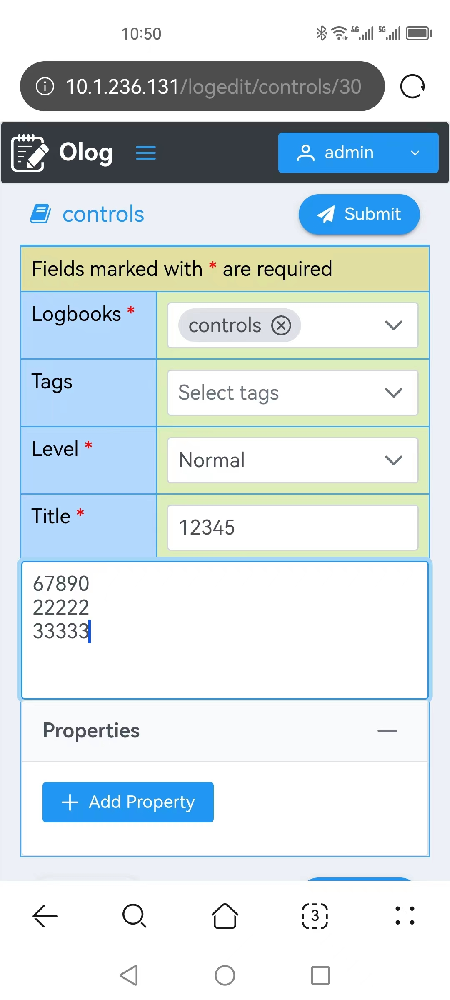

# Mobile web client for Olog

A mobile web client that communicates with the Olog Spring Boot web service, it provides functions of user login, reading logs, creating logs and updating logs.


The official websites for Olog are as follows,

https://github.com/Olog/phoebus-olog

https://github.com/Olog/phoebus-olog-web-client

https://olog.readthedocs.io/en/latest/

## Technical solution

* Vue.js: front-end JavaScript framework
* Vuex: state management library
* PrimeVue: Vue.js component library
* axios: HTTP client for the browser
* js-cookie: JavaScript API for handling cookies

## Supported Node.js versions

The following Node.js versions have been tested,

* Node.js 18.13.0
* Node.js 17.9.1
* Node.js 16.19.0
* Node.js 15.14.0
* Node.js 14.21.3

## Menu items

* Home: logbook summary
* Logbooks: logbook list
* Tags: tag list
* Properties: property list
* About: software information


## Available options

Available options for logbook, tag and property can be displayed,


## User login


## Read logs


## Create logs


## Update logs





## Cookie manangment

Cookie **SESSION** will be set by Olog service when the user login successfully.

Cookie **ologMobileUserData** will be used by the mobile web client to store the user data.

## Development and deployment

### Configuration

Edit the following files if needed,
```
./src/config/configuraion.js
```

### Development

```
npm install
npm run serve
```

### Deployment

```
npm install
npm run build
cp -r dist/* /var/www/html
```

### Visit web pages

By default, the web pages can be visited on Port 8080,
```
http://localhost:8080/
```

## Get Olog service up and running on Windows 10

1. Install the latest JDK from the Oracle website.

2. Install MongoDB.

3. Install and start Elasticsearch.
```
cd elasticsearch-8.7.1
bin\elasticsearch.bat
```

4. Install Apache NetBeans IDE.

5. Git clone the latest phoebus-olog source code.

6. In NetBean, click "File - Open Project" to open the phoebus-olog Maven project.

7. Edit the following two lines in application.properties file,

```
embedded_ldap.enabled = true
cors.allowed.origins=http://localhost:3000,http://localhost:8081,http://10.1.236.131
```

8. In NetBean, click "Clean and Build".

9. In NetBean, click "Run Project".

10. By default, the Olog service can be visited on Port 8080,
```
http://localhost:8080/Olog
http://localhost:8080/Olog/logs
http://localhost:8080/Olog/logbooks
http://localhost:8080/Olog/tags
http://localhost:8080/Olog/properties

```
